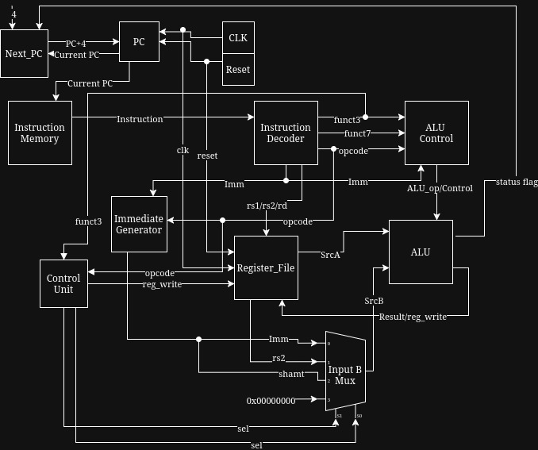

# RV32I Single-Cycle RISC-V CPU in SystemVerilog, with C++ Assembler and Verification

> An in-progress hardware/software co-design project implementing a custom single-cycle RISC-V CPU in SystemVerilog with it's own assembler. Automated verification using C++ and Bash on Linux.

[](https://github.com/HamzaAndishmand/rv32i/actions/workflows/ci.yml)


## Overview
This project contains the documentation of a single-cycle RV32I RISC-V processor that was implemented from scratch useing SystemVerilog, with
the toolchain to program it being an assembler in C++ that translates RISC-V assembly into machine code for the core to execute. All modules
are verified through self-checking testbenches against independednt refrence models, all simulated under Verilator and are run automatically
in CI after every push.


## Project Status
**Current Working:**
- ALU with a self-checking testbench and independent oracle
- C++ assembler that converts R-type instructions to 32 bit binary machine code
- CI pipeline under Verilator
- Decoders, register file, PC, and immediate generator as verified standalone modules

**Soon to be added:** 
- Single-cycle datapath integration
- C++ golden reference models for every other module
- I, S and B type instructions planned for assembler as CPU grows

## Architecture


## Verification Philosophy

All modules are checked against a refrence model. Each modules' testbench drives the DUT with random inputs then compares the outputs against the oracle
which also implements the same operations from the spec, independent from the RTL. This system has done a good job at flaging bugs (see bug log below).

Currently, oracles are written in SystemVerilog within each testbench. Porting the oracles to C++ golden models is the next step after datapath integration.

CI currently runs the ALU testbench via Verilator on every push with more modules soon to be added as their testbenches come online.

## Bug Log

**Description:** 3/16 ALU tests failed on SLL/SRL/SRA vectors, RTL returning 0 compared to oracle which expected nonzero results.

**Root cause:** RTL (ALU.sv) shifted by the full 32-bit B input. The problem is that SystemVerilog
shift semantics return 0 when the shift amount is greater than or equal to the bit-width, which
was true for almost all of the random 32-bit values generated.

**Fix:** Masked the shift amount to [4:0] in the ALU module RTL to match. (commit 4520ec6)

**Verified:** All 16 ALU test cases pass after fix.

## Known Issues
- ALU contains non-RV32i operations, NOT, NAND, XNOR, SEQ, MULT and DIV which belong to the M-extension rather than the ISA
- ALU `status` output is hardcoded to 0, presently dead code. Zero and overflow flags to be implemented.
- Latch inference risk in Instruction_Decoder, due to not having default branch as well as not assigning `funct7`/`imm` on every path.
- Assembler does not yet produce output. Still in progress.
- No edge cases when testbenching, only 16 random vectors. Directed cases with larger constraind random sweep are planned.
- CI only covers ALU testbench. More modules soon to be added as soon as the testbenches are complete.
- CI installs Verilator through apt (Ubuntu 24.04 ships 5.020). Local development uses a newer version.
- No integrated datapath yet. Modules are verified standalone. Single-cycle CPU integration is the next milestone after the
  assembler.

## Build & Run

**Required**
- Verilator (Tested locally on 5.0x. CI uses Ubuntu 24.04's apt package)
- GNU Make

**Steps**
```bash
git clone https://github.com/HamzaAndishmand/rv32i.git
cd rv32i
make sim_verilator
```

**Expected output:**
```bash
Total tests passed:          16
Total tests failed:           0
- Testbench/ALU_tb.sv:39: Verilog $finish
- Verilator: $finish at 240ps; walltime 0.000 s; speed 6.602 us/s
```

To clean build artifacts:
```bash
make clean
```
